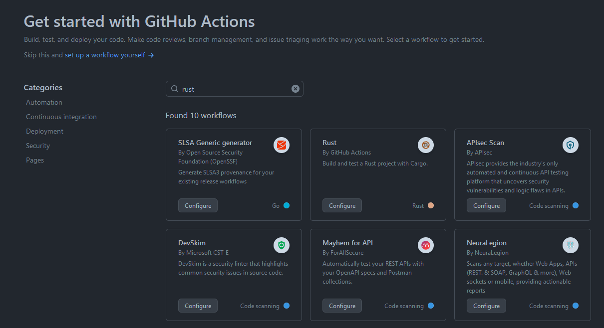

We need to create GitHub action for setting up CI.
We will click on Actions tab, and search for Rust.



When clicking on it, we are presented with rust.yml file

rust.yml

```yaml
name: Rust

on:
  push:
    branches: [ "feature/lab5" ]
  pull_request:
    branches: [ "feature/lab5" ]

env:
  CARGO_TERM_COLOR: always

jobs:
  build:

    runs-on: ubuntu-latest

    steps:
    - uses: actions/checkout@v3
    - name: Build
      run: cargo build --verbose
    - name: Run tests
      run: cargo test --verbose
```

After editing branch name from `main` to `feature/lab5`, I clicked commit new file.
