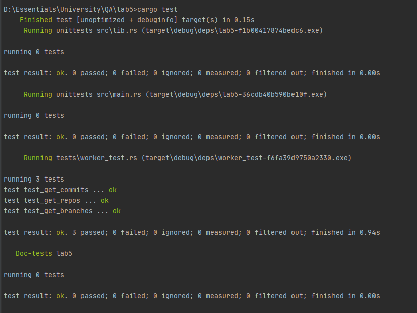
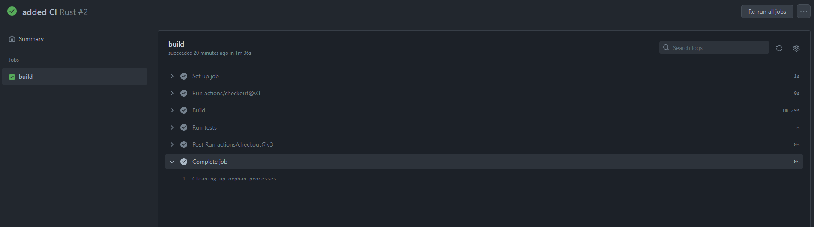

Report

## General information

For this task, I used Rust programming language. Rust is a compiled language that stores binaries in `target` folder.
`Cargo.toml` file has necessary configs for project.
`cargo` is a package manager for rust, it is kind of similar to `npm` of javascript.
I use CLion for Rust development, and created the project using it.

## Code

For implementing integration tests to Rust binary application, I used the structure from the following github url.
https://github.com/rust-lang/book/issues/1940

Main logic is in `worker.rs` file, which consists of 3 similar functions.
```rust
pub fn get_repos() -> String
{
    let res = reqwest::blocking::get("https://60a21d3f745cd70017576092.mockapi.io/api/v1/repos").unwrap();
    let body = res.text().unwrap();
    println!("{}", body);

    body
}
```

In `get_repos()` function, I used reqwest library (https://crates.io/crates/reqwest) to get an http response.
After unwrapping the data (converting from `Result<Response>` to `Response`), I took the content of the response
and unwrapped it, getting `String`. I printed the `body` for debugging purposes, and returned it from the function.

`worker_test.rs` contains integration tests for these 3 functions.

```rust
#[test]
fn test_get_repos() {
        assert_eq!(worker::get_repos(), r#"[{"id":"1","createdAt":"2021-05-16T13:57:15.119Z","name":"dolorum-quis-impedit"},{"id":"2","createdAt":"2021-05-16T21:45:33.803Z","name":"numquam-cupiditate-aut"},{"id":"3","createdAt":"2021-05-17T01:24:03.083Z","name":"dolorem-explicabo-aperiam"},{"id":"4","createdAt":"2021-05-17T01:03:43.831Z","name":"voluptas-consequuntur-nihil"},{"id":"5","createdAt":"2021-05-17T05:40:14.989Z","name":"omnis-ut-in"},{"id":"6","createdAt":"2021-05-16T19:16:30.942Z","name":"cumque-in-a"},{"id":"7","createdAt":"2021-05-17T03:01:18.297Z","name":"adipisci-accusantium-voluptatem"},{"id":"8","createdAt":"2021-05-17T02:52:51.646Z","name":"ex-provident-quos"},{"id":"9","createdAt":"2021-05-17T00:48:53.846Z","name":"provident-accusantium-commodi"},{"id":"10","createdAt":"2021-05-17T04:09:46.886Z","name":"modi-aliquam-maiores"},{"id":"11","createdAt":"2021-05-16T11:59:18.048Z","name":"molestiae-maxime-odio"},{"id":"12","createdAt":"2021-05-16T21:38:37.802Z","name":"laborum-reprehenderit-dolore"},{"id":"13","createdAt":"2021-05-16T15:36:28.121Z","name":"aut-ipsum-ut"},{"id":"14","createdAt":"2021-05-17T05:40:37.617Z","name":"aut-maiores-est"},{"id":"15","createdAt":"2021-05-17T04:07:37.366Z","name":"et-vero-qui"}]"#);
}
```

Here we use `#[test]` attribute to indicate that following function is test.
In function body, `assert_eq!` macro returns passing test when two supplied values are equal, otherwise returns false.

For testing locally, we run `cargo test`. Rust looks for 3 types of tests by default: unit, integration and doc tests.
Here is the output.



You can read more about testing in Rust here: https://doc.rust-lang.org/rust-by-example/testing.html
## CI
We need to create GitHub action for setting up CI.
We will click on Actions tab, and search for Rust.


When clicking on it, we are presented with rust.yml file

`rust.yml`

```yaml
name: Rust

on:
  push:
    branches: [ "feature/lab5" ]
  pull_request:
    branches: [ "feature/lab5" ]

env:
  CARGO_TERM_COLOR: always

jobs:
  build:

    runs-on: ubuntu-latest

    steps:
    - uses: actions/checkout@v3
    - name: Build
      run: cargo build --verbose
    - name: Run tests
      run: cargo test --verbose
```

After editing branch name from `main` to `feature/lab5`, we copy the file and paste it into
`.github/workflows/rust.yml` that we create manually.

After commit and push to `feature/lab5` branch, we should see github action executing automatically.



Execution was successful, which means all 3 tests were completed.